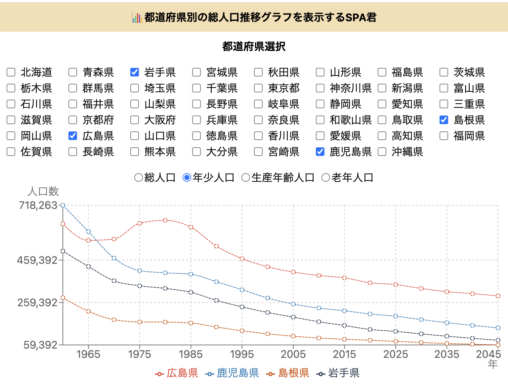

# 都道府県別の総人口推移グラフを表示するSPA君



## アプリURL

https://japan-population-trends-indol.vercel.app/

## Storybook URL

https://japan-population-trends-indol.vercel.app/storybook/

## setup

依存パッケージインストール

```
npm install
```

認証情報秘匿の為の踏み台サーバー起動

```
npm run server
```

フロンエンド起動

```
npm run dev
```

## 構成

### Frontend

Vite

### Backend

hono

### その他

- eslint
- stylelint
- prettier
- vitest

### デプロイ

vercel
